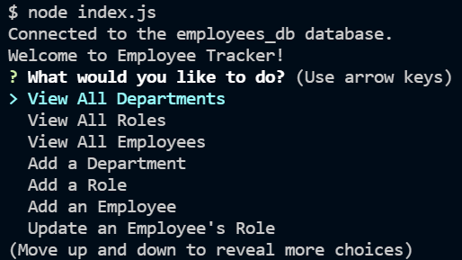
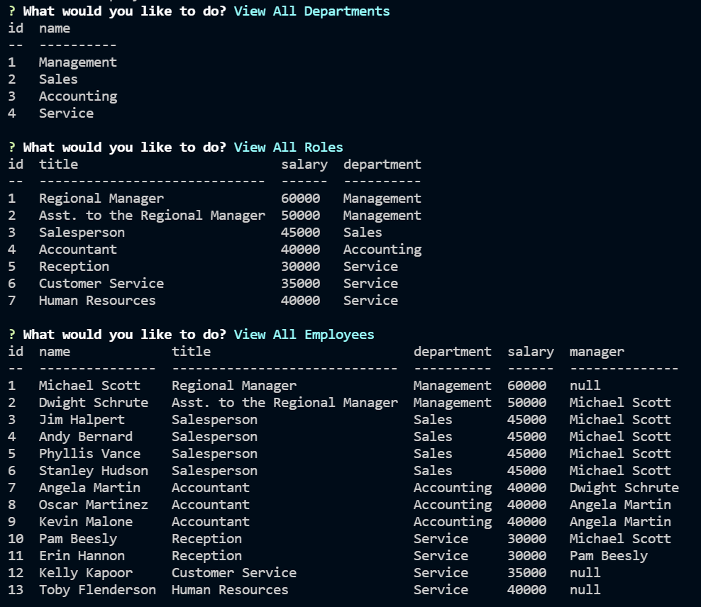
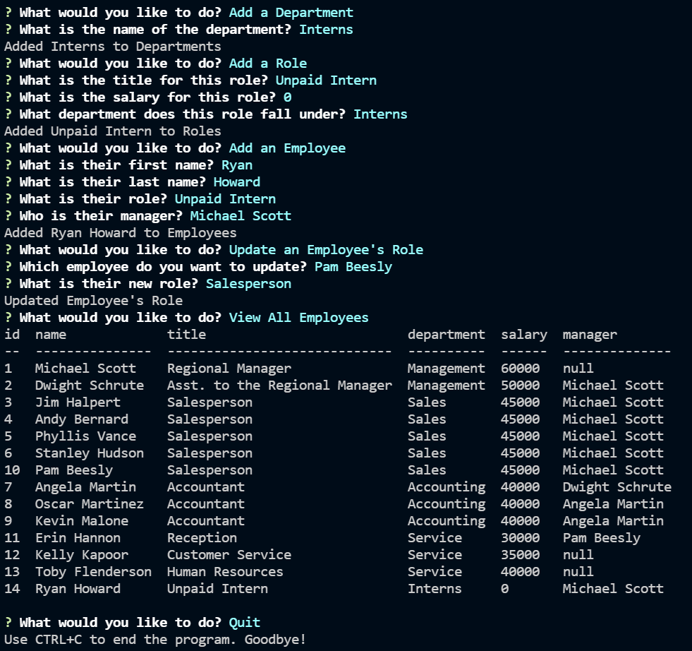

# Employee Tracker

A command-line application that uses Node.js, Inquirer, and MySQL to manage a company's employee database. By following the prompts, the user can view a list of departments, roles, and employees. The user can create and assign new employees, roles, and departments to add to their database.

## Links

## Installation

```
MUST HAVE NODE.JS INSTALLED

Perform a Git Clone into the appropriate directory in your local file system.

In the command line at the root of your directory, type "npm install".

If the user does not already have an employees_db, they will need to run "source db/schema.sql" in the MySQL CLI at the root of the directory.

To populate with pre-existing data, run the command "source db/seeds.sql" in the same location.

To use this project, run "node index.js" and answer the prompts.
```

## Screenshots





